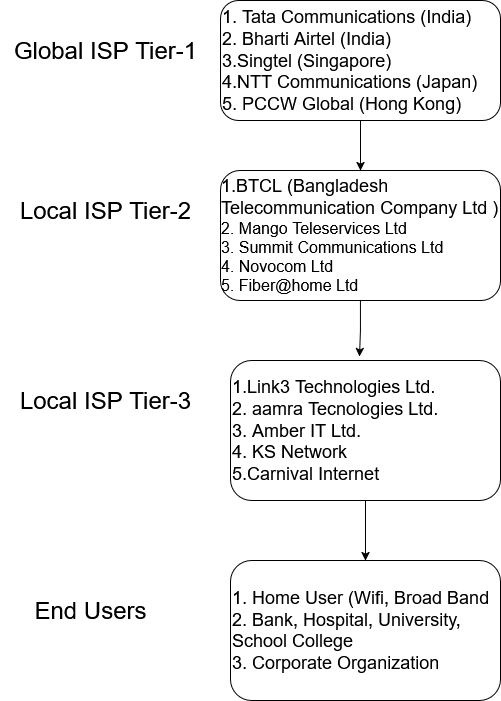

# Topic: Distributed Networking Application System Design Architecture 

__পর্ব ঃ ০১__

একটি Software Firm এ বিভিন্ন programming language এর টীম যেমন PHP, Java, Node.js এর ভিন্ন ভিন্ন টীম থাকে, যারা এসকল server-side programming language দিয়ে একটি বিশাল বড়  Network Application এর বিভিন্ন Service বা Micro-Service লিখে থাকেন।  আমরা যেহেতু  Network Application নিয়ে বেশি কাজ করি, তাই চিন্তা করলাম, একটি স্টেপ বাই স্টেপ network application এর System Architecture শুরু থেকে শেষ পর্যন্ত কত গুল পর্বে আলোচনা করবো। তারই ধারবাহিকতায়, আজকে শুরু করছি Distributed Networking Application System design এর প্রথম পর্বঃ ইন্টারনেট ।

দুইটি Host Machine বা end System একে অপরের সাথে communication করার জন্য, বা একটি client যখন server এর কাছে HTTP বা client-server প্রটোকল দিয়ে  রিকুয়েস্ট করে response  পাচ্ছে, এটার জন্য যে সাত সমুদ্র ১৩ নদী পার হতে হয় তা খুব একটা বুজতে পারিনা। কিন্তু মনে হয় বোঝা যায়, যখন  client এরর রেস্পন্স দেয়  “৪০৮ - রিকুয়েস্ট টাইম আউট”! 

যাই হোক, আমরা সব কিছু Details আলোচনা করবো পর্বে পর্বে। আজকের  ব্লগ টিতে আমি একটি ছোট্ট নেটওয়ার্ক ডায়াগ্রাম দিয়ে শুরু করবো। সেখান থেকে আলোচনা গড়িয়ে পড়বে, ডুপ্লেক্স Stream, ট্রান্সফরম Stream এ। আমরা কিভাবে ১০ জিবি  বা বিশাল বড় বড় ফাইল ( Audio, Video, pdf, Movie, Text file) ইত্যাদি ট্রান্সফার করতে পারি  HTTP ফাইল স্ট্রিম (Readable, Writable) এর মাধ্যমে  এই বিষয় এও আলোচনা করা হবে। এই পর্ব গুলোর শেষ এ আপনি বুঝতে পারবেন কিভাবে Facebook, Youtube, Netflix বিশাল বড় বড় ফাইল কে  তারা Stream (Chunk by Chunk) করে আপনার Device এ response পাঠাচ্ছে with Zero data loss। তাছাড়াও TCP (Transport Communication Protocol) and UDP (User Datagram Protocol) গুলো নেটওয়ার্ক লেয়ারের কোথায় কোথায় কাজ করে সে বিষয় এ বিশেষ ভাবে আলোচনা করা হবে। আর হ্যা, Socket Programming যে TCP লেয়ারে কাজ করে এবং এটা যে একটা Duplex Stream এটাও একদম পানির মতো পরিস্কার হয়ে যাবেন, আশা করছি। 

আমি যে এতোক্ষন বকর বকর করলাম, এটার একটু Road Map দিয়ে দেই নাহলে পরের পর্ব গুলো আশার আগে ।
১। সবার প্রথমে Buffer কি এটা সম্পর্কে খুবি ভালোভাবে জানতে হবে, প্রগ্রামিং এর ভাষায় এটি একটি Simple Data stracture. এই বাফার এর মাধ্যমেই মূলত parent process to child process, child process to child process কমনিকেশন হয়, যেটাকে আমরা IPC বা Inter Process Communication বলে থাকি। আবার পারেন্ট Thread , চাইল্ড Thread এর মধ্যেও এই বাফার দিয়েই Communicaiton হয়।
২। Stream মূলত চার ধরনের। Readable Stream, Writable Stream, Duplex Stream and Transformation Stream.
৩। Socket Programming, socket object এটা মূলত Duplex Stream.
৪। HTTP, TCP, UDP protocol. 

তারমানে ঃ Buffer → Stream → Socket Programming  → HTTP, UDP, TCP

আমরা আসলে প্রথম ৩ টা স্টেপ ভালো ভাবে না শিখেই API লিখতে বসে যাই, যার কারনে API এর পারফর্মেন্স খুবই খারাপ হয়, বড় বড় ফাইল ট্রান্সফার করতে পারি না,  এরকমও বলা হয় এটা  অন্য কোন টুল দিয়ে সমাধান করতে হবে যেটার cost অনেক বেশি। মানে সেই টুল সেটাপ করা maintenance  করা ইত্যাদি ইত্যাদি। 

একটি ছোট্ট নেটওয়ার্ক ডায়াগ্রাম তুলে ধরা হলোঃ

উপরের এই Diagram আলোচনা করে আমরা আজকের প্রথম পর্ব শেষ করবো। 
এখানে মোটা দাগে বেশ কতগুলো Term লক্ষ্য করছি।

১। যেখান থেকে আসলে internet আমাদের দেশে আসে সেটার প্রভাইডার এমন একটি সংস্থা যা বিশ্বব্যাপী ইন্টারনেট সংযোগ প্রদান করে। এরা মূলত Tier-1 ISP নামে পরিচিত এবং নিজেদের মধে উচ্চগতি ব্যাকবোন নেটওয়ার্ক তৈরি করে। এর মাধ্যমে তারা বিভিন্ন দেশে লোকাল ISP (Tier-2 বা Tier-3 ISP) এবং corporate organization গুলোতে internet service সরবরাহ করে থাকে। 

২। লোকাল ISP প্রভাইডার এর কাছ থেকে আমরা বাসা বাড়ি, অফিস ইত্যাদি তে Internet সংযোগ নিয়ে থাকি। এখানে, Global ISP (Tier-1) থেকে (Tier-2) তুলনা মূলক কম ব্যান্ড উইডথ কিনে থাকে। আবার Tier-2 এর কাছ থেকে Tier-3 এটা আরো কম ব্যান্ডউইডথ। অবশেষ এ Tier-3 থেকে End User এর কাছে ইন্টারনেট সংযোগ স্থাপন হয়। 
In summary: 
`Global ISP (Tier-1)  → Local ISP(Tier-2)  → Local ISP (Tier-3)  → End User`

৩। Data Center Network: 
ডাটাসেন্টার নেটওয়ার্ক (Datacenter Network) হলো এক ধরনের উচ্চক্ষমতাসম্পন্ন কম্পিউটার নেটওয়ার্ক, যা সার্ভার, স্টোরেজ, এবং নেটওয়ার্ক ডিভাইসগুলোর মধ্যে দ্রুত এবং নির্ভরযোগ্য যোগাযোগ নিশ্চিত করে। এটি মূলত বড় প্রতিষ্ঠান, ক্লাউড সার্ভিস প্রোভাইডার (যেমন AWS, Google Cloud, Azure), এবং ইন্টারনেট কোম্পানিগুলোর জন্য অপরিহার্য। এখন এই ডাটা সেন্টার গুলো কোথায় আছে, বিশেষ করে বাংলাদেশে, সেগুলো একটু জেনে আসা দরকার। 
বাংলাদেশ ডেটা সেন্টার কোম্পানি লিমিটেডঃবিডিসিসিএল একটি সরকারি মালিকানাধীন প্রতিষ্ঠান, যা ২০১৯ সালে প্রতিষ্ঠিত হয়।
এই ডেটা সেন্টারটি ৭ একর জায়গাজুড়ে বিস্তৃত এবং এটি বিশ্বের সপ্তম বৃহত্তম ডেটা সেন্টার হিসেবে পরিচিত। এটি জি-ক্লাউড প্রযুক্তি ও উন্নত ক্লাউড কম্পিউটিং সুবিধাসহ বিভিন্ন সেবা প্রদান করে, যেমন ক্লাউড কম্পিউটিং, ক্লাউড ডেস্কটপ, ক্লাউড স্টোরেজ, ডেটা স্টোরেজ ও ব্যাকআপ, ডেটা নিরাপত্তা, এবং কো-লোকেশন সেবা।  
https://bdccl.gov.bd/

জাতীয় ডেটা সেন্টারঃবাংলাদেশ কম্পিউটার কাউন্সিল (বিসিসি) জাতীয় ডেটা সেন্টার পরিচালনা করে, যা সরকারি বিভিন্ন সেবার ডেটা সংরক্ষণ ও পরিচালনার জন্য ব্যবহৃত হয়। এটি দেশের তথ্যপ্রযুক্তি অবকাঠামোর একটি গুরুত্বপূর্ণ অংশ। https://bcc.gov.bd/
বেসরকারি ডেটা সেন্টার
বাংলাদেশে বেসরকারি খাতেও ডেটা সেন্টার স্থাপনের উদ্যোগ দেখা যায়। বর্তমানে দেশে ছয়টি ডেটা সেন্টার রয়েছে, যার মধ্যে পাঁচটি ঢাকায় এবং একটি চট্টগ্রামে অবস্থিত। ঢাকা কোলো নামে একটি প্রতিষ্ঠান তিনটি ডেটা সেন্টার পরিচালনা করছে, এছাড়া কোলো সিটি, ডেভো টেক, এবং জিওন বিডি একটি করে ডেটা সেন্টার পরিচালনা করছে। ডেভো টেক ক্লাউড সার্ভিস প্রদানকারী প্রতিষ্ঠান হিসেবেও কাজ করে। 
বাংলাদেশ ডেটা সেন্টার এন্ড ডিজাস্টার রিকভারি সাইট লিমিটেড
এই প্রতিষ্ঠানটি ডেটা সেন্টার এবং ডিজাস্টার রিকভারি সেবা প্রদান করে, যা বিভিন্ন প্রতিষ্ঠানের তথ্য নিরাপত্তা ও পুনরুদ্ধার প্রক্রিয়ায় সহায়তা করে।বাংলাদেশের ডেটা সেন্টার অবকাঠামো দেশের ডিজিটাল অগ্রগতিতে গুরুত্বপূর্ণ ভূমিকা পালন করছে, যা তথ্য নিরাপত্তা, সেবা নিরবচ্ছিন্নতা, এবং ডিজিটাল সেবার প্রসারে সহায়তা করছে। bdcdrsl.portal.gov.bd

তাছাড়াও কোন দেশে কতগুলো ডেটা সেন্টার রয়েছে সে সম্পর্কে তথ্য জানতেঃ 

[stat data](./public/stat-data.jpg)

https://banglanews24.com/information-technology/news/bd/840959.details?utm_source=chatgpt.com

৪। Enterprise Network: একটি বৃহৎ প্রতিষ্ঠানের তথ্য-প্রবাহ ও যোগাযোগ অবকাঠামো, যা বিভিন্ন অফিস, ডাটাসেন্টার, ব্রাঞ্চ, রিমোট ইউজার, এবং ক্লাউড সার্ভিসগুলোর মধ্যে নিরবচ্ছিন্ন সংযোগ নিশ্চিত করে।

৫। Content Provider Network: এখানে একটু বিস্তারিত আলোচনার প্রয়োজন রয়েছে। 
কনটেন্ট প্রোভাইডার নেটওয়ার্ক (Content Provider Network) হলো এমন একটি নেটওয়ার্ক অবকাঠামো, যা ব্যবহারকারীদের কাছে দ্রুত এবং দক্ষতার সাথে ডিজিটাল কনটেন্ট পৌঁছে দেয়। এটি সাধারণত বড় প্রযুক্তি প্রতিষ্ঠান, মিডিয়া কোম্পানি, স্ট্রিমিং সার্ভিস, এবং ওয়েবসাইটগুলোর জন্য ব্যবহৃত হয়, যেখানে ভিডিও, ইমেজ, ওয়েবপেজ, এবং অন্যান্য ডেটা দ্রুত ডেলিভারি করার প্রয়োজন হয়।

🔹 স্ট্রিমিং সার্ভিস: YouTube, Netflix, Disney+, Spotify
🔹 নিউজ ও মিডিয়া: BBC, CNN, The New York Times
🔹 ই-কমার্স: Amazon, eBay, Alibaba
🔹 ওয়েব হোস্টিং: WordPress, Shopify
🔹 গেমিং সার্ভার: Steam, PlayStation Network, Xbox Live

৬। Mobile Network: 
একটি ওয়্যারলেস যোগাযোগ ব্যবস্থা, যা মোবাইল ফোন এবং অন্যান্য ওয়্যারলেস ডিভাইসগুলোর মধ্যে যোগাযোগ স্থাপন করতে ব্যবহৃত হয়।
৭। Home Network: হোম নেটওয়ার্ক হলো একটি ব্যক্তিগত নেটওয়ার্ক, যা একটি বাড়ির ভেতরে বিভিন্ন ডিভাইসকে একসাথে সংযুক্ত করে। এটি ওয়াই-ফাই (Wi-Fi) বা ইথারনেট (Ethernet) ক্যাবলের মাধ্যমে গঠিত হয় এবং সাধারণত ইন্টারনেট সংযোগের মাধ্যমে বাইরের বিশ্বের সাথে যোগাযোগ করে।

আপনি যদি এই ছোট্ট নেটওয়ার্ক ডায়াগ্রাম  এর বিস্তারিত বর্ণনা পড়ে থাকেন তাহলে Congratulations। আমার এই ব্লগের প্রথম পর্বে আপনার মোটামোটি একটি idea এসেছে যে internet আসলে কি। হ্যা ইন্টারনেট একটি জটিল ও বিস্তৃত যোগাযোগ ব্যবস্থা, যা বিশ্বের বিভিন্ন জায়গায় থাকা রাউটার, তার, এবং কম্পিউটারগুলোর মধ্যে তথ্য বিনিময়ের মাধ্যমে কাজ করে। এটি একটি বিশাল নেটওয়ার্কের মতো কাজ করে, যেখানে প্রতিটি ডিভাইস বা কম্পিউটার একে অপরের সাথে সংযুক্ত থাকে এবং একে অপরের সাথে তথ্য শেয়ার করে।

শুরুতেই বলেছিলাম আমরা কিভাবে একটা ১০ জিবির ভিডিও ফাইল বা ডেটাবেইজ কে একটা end system (Server/Host) থেকে অন্য আরেকটি end system (Client/Host) Chunk by Chunk stream করবো। তো নিচের ছোট্ট ডায়াগ্রাম টি একটু লক্ষ্য করিঃ
ধরুন আপনার ভিডিও একটি ১০ জিবি এর ফাইল ছবি তে থাকা পয়েন্ট A তে রয়েছে, বা ধরেন এটা একটা ফাইল সার্ভার। এখন আপনি এই সার্ভার থেকে ডেটাকে ডাউনলোড করতে চাচ্ছেন, অথবা আপনার ব্রাউজার এ এই ভিডিও ফাইল টিকে রান করে দেখতে চাচ্ছেন, Youtube বা netflix এ যেভাবে দেখেন আরকি। তাহলে এতোবড় ডাটা কিভাবে আমরা Stream করে নিয়ে আসি ? 
আসলে আমরা যখন রিকুয়েস্ট পাঠাই সার্ভার এ তখন এই রিকুয়েস্ট টা হয় একটা Readable Stream , আবার এই রিকুয়েস্ট কে যখন রেস্পন্স করে নিয়ে এসে আমাদের লোকাল computer এর কোথাও রাখা হয় বা ব্রাউজার এ ভিডিও দেখানো হয় তখন এই রেস্পন কে আমরা বলি writable Stream ।

তো পয়েন্ট A থেকে পয়েন্ট B তে ১০ জিবি ডাটা ট্রান্সফার করার সময় আমরা নেটওয়ার্ক লেয়ার এর Application Layer, Transport Layer, Network Layers, Data link layer, Physical Layer গুলো রেস্পন্স এর সময় কোথায় কোথায় থাকে সেগুলো আলোচনা করবো।

[end-system-interation](./public/end-system-interaction.png)